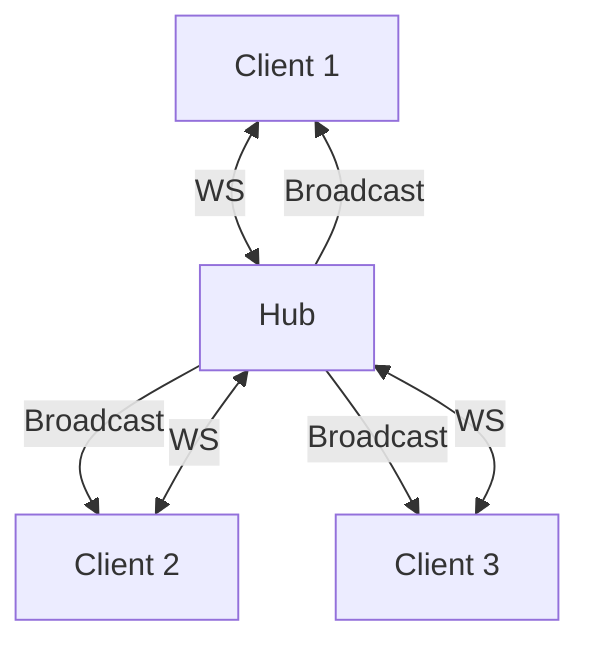

## Introduction

When developing TeamUp Hub, I needed to implement a real-time chat system. WebSockets were the obvious solution, but their implementation in Go has its subtleties.

## What is a WebSocket?

A WebSocket is a bidirectional, persistent communication protocol. Unlike HTTP (request-response), a WebSocket maintains an open connection, allowing the server to send data to the client without waiting for a request.

## Implementation in Go

### The gorilla/websocket package

The `gorilla/websocket` package is the de facto standard for WebSockets in Go:

```go
var upgrader = websocket.Upgrader{
    ReadBufferSize:  1024,
    WriteBufferSize: 1024,
    CheckOrigin: func(r *http.Request) bool {
        return true // In production, check the origin
    },
}
```

### The Hub pattern

The Hub pattern centralizes connection management:

```go
type Hub struct {
    clients    map[*Client]bool
    broadcast  chan []byte
    register   chan *Client
    unregister chan *Client
}
```

Here is how everything seamlessly connects:



### The Hub Loop

The core of the system lies in the `Run()` method, which uses a `select` statement to handle concurrency in a non-blocking way:

```go
func (h *Hub) Run() {
    for {
        select {
        case client := <-h.register:
            h.clients[client] = true
        case client := <-h.unregister:
            if _, ok := h.clients[client]; ok {
                delete(h.clients, client)
                close(client.send)
            }
        case message := <-h.broadcast:
            for client := range h.clients {
                select {
                case client.send <- message:
                default:
                    // If client blocks, drop it to avoid freezing the Hub
                    close(client.send)
                    delete(h.clients, client)
                }
            }
        }
    }
}
```

Each client has two goroutines: one for reading, one for writing. The Hub orchestrates messages between all connected clients.

## Error handling

WebSockets can disconnect at any time. You need to handle:
- **Timeouts** with regular pings/pongs
- **Abrupt disconnections** by cleaning up resources
- **Malformed messages** with strict validation

## Lessons learned

1. **Always use goroutines** for reading and writing — never block the main goroutine.
2. **Implement ping/pong** to detect dead connections.
3. **Limit message size** to prevent memory saturation attacks.
4. **Test with multiple connections** — concurrency bugs often only appear under load.

### The Orphaned Goroutines Trap

Early in the project, I encountered a nasty bug: the server's memory usage would climb indefinitely. The cause? Disconnections weren't always properly closing the `send` channel in edge cases. As a result, thousands of "zombie goroutines" were left blocked, waiting to write to a phantom client.

The lesson: always use a `select` with a `default` case or a timeout when sending to non-buffered channels, and ensure every goroutine has a clear exit condition (like a channel closure).

## Conclusion

WebSockets in Go are powerful but require a good understanding of concurrency. The Hub pattern remains the best approach for managing multiple simultaneous connections.
