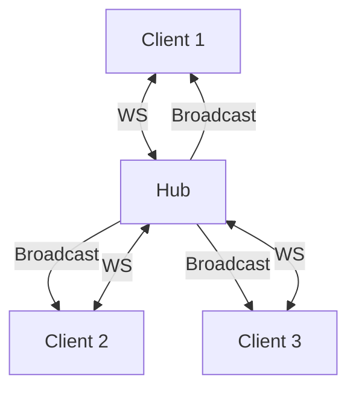

## Introduction

Lors du développement de TeamUp Hub, j'ai dû implémenter un système de chat en temps réel. Les WebSockets étaient la solution évidente, mais leur implémentation en Go a ses subtilités.

## Qu'est-ce qu'un WebSocket ?

Un WebSocket est un protocole de communication bidirectionnel et persistant. Contrairement à HTTP (requête-réponse), un WebSocket maintient une connexion ouverte, permettant au serveur d'envoyer des données au client sans attendre une requête.

## Implémentation en Go

### Le package gorilla/websocket

Le package `gorilla/websocket` est le standard de facto pour les WebSockets en Go :

```go
var upgrader = websocket.Upgrader{
    ReadBufferSize:  1024,
    WriteBufferSize: 1024,
    CheckOrigin: func(r *http.Request) bool {
        return true // En production, vérifier l'origine
    },
}
```

### Le Hub pattern

Le pattern Hub centralise la gestion des connexions :

```go
type Hub struct {
    clients    map[*Client]bool
    broadcast  chan []byte
    register   chan *Client
    unregister chan *Client
}
```

Voici comment le tout s'orchestre :



### La boucle du Hub

Le cœur du système réside dans la méthode `Run()`, qui utilise un `select` pour gérer la concurrence de manière non-bloquante :

```go
func (h *Hub) Run() {
    for {
        select {
        case client := <-h.register:
            h.clients[client] = true
        case client := <-h.unregister:
            if _, ok := h.clients[client]; ok {
                delete(h.clients, client)
                close(client.send)
            }
        case message := <-h.broadcast:
            for client := range h.clients {
                select {
                case client.send <- message:
                default:
                    // Si le client bloque, on le déconnecte pour ne pas figer le Hub
                    close(client.send)
                    delete(h.clients, client)
                }
            }
        }
    }
}
```

Chaque client a deux goroutines : une pour la lecture, une pour l'écriture. Le Hub orchestre les messages entre tous les clients connectés.

## Gestion des erreurs

Les WebSockets peuvent se déconnecter à tout moment. Il faut gérer :
- Les **timeouts** avec des pings/pongs réguliers
- Les **déconnexions brutales** en nettoyant les ressources
- Les **messages malformés** avec une validation stricte

## Leçons apprises

1. **Toujours utiliser des goroutines** pour la lecture et l'écriture — ne jamais bloquer la goroutine principale.
2. **Implémenter le ping/pong** pour détecter les connexions mortes.
3. **Limiter la taille des messages** pour éviter les attaques par saturation mémoire.
4. **Tester avec des connexions multiples** — les bugs de concurrence n'apparaissent souvent qu'en charge.

### Le piège des goroutines orphelines

Au début du projet, j'ai rencontré un bug sournois : la mémoire du serveur augmentait indéfiniment. La cause ? Chaque déconnexion ne fermait pas proprement le channel `send` dans certains cas limites. Résultat : des milliers de "goroutines zombies" restaient bloquées en attente d'écriture sur un client fantôme. 

La leçon : toujours utiliser un `select` avec une case `default` ou un timeout lors des envois sur des channels non-buffered, et s'assurer que chaque goroutine a une condition de sortie claire (comme la fermeture d'un channel).

## Conclusion

Les WebSockets en Go sont puissants mais demandent une bonne compréhension de la concurrence. Le pattern Hub reste la meilleure approche pour gérer plusieurs connexions simultanées.
